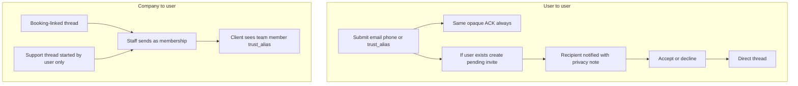

# In-app messaging — implementation plan

Last updated: 2026-07-18

Feature flag: `featureFlags.messagesEnabled` (web) / equivalent Flutter flag — **off** until M5/M6 ship.

**Formula:** overall = sum of completed sub-weights across phases M0–M7 (weights total 100%). Track Backend / Flutter / Angular checkboxes per phase.

Related: privacy-first Trust Alias, booking client visibility, [docs/web/implementation.md](../web/implementation.md).

---

## 1. Product rules

### 1.1 User ↔ user (direct) — anti-enumeration invites

- Initiator submits a target **email**, **phone**, or **trust alias**.
- **API always returns the same opaque success** (same status + copy), whether or not a matching user exists — e.g. “If this person is on Vaxiil, an invitation will be sent.” Initiator **never** learns existence, online status, or profile from the invite flow.
- **Server-side only:** if a user matches, create a **pending invitation**; if not, no-op. Timing should be roughly constant (avoid timing oracles). Rate-limit invite submits.
- Recipient notification (when invite exists) must state that the **requester cannot see whether they are on the platform until they accept**. Decline / ignore / block: requester still gets no existence signal.
- Until accepted: no chat content; only the invite notice to the recipient.
- After accept: 1:1 direct thread. Peers shown primarily by trust alias unless they share real identity via prefs.

### 1.2 Company ↔ user (constrained)

Companies may **not** open arbitrary DMs with users. Only:

| Thread type | Who can open | Scope |
|-------------|--------------|--------|
| **Booking thread** | Org staff **or** client, once a booking exists | Tied to `booking_id` |
| **Support ask** | **User only** starts | User picks org; org staff may reply afterward |

No cold outreach from company → user outside booking/support.

### 1.3 Attribution on org-side messages

- Persist `sender_user` + `sender_membership` on each staff message.
- **Client-facing payload** shows that member’s **trust alias** only (not legal name/email/phone).
- Internal org UI may show richer staff identity for the company’s own team.

### 1.4 Thread block / unblock

- Any participant can **block** a conversation until they **unblock**.
- While blocked by either side: **neither** side can **send** new messages (clear “blocked” error). Blocker may still read history.
- Unblock restores send (if conversation still `active`).
- Blocking a **pending P2P invite** = decline + block (suppress further invites from that peer until unblock).

### 1.5 Alias regeneration

- `POST /auth/regenerate-alias/` invalidates old lookup key.
- Pending P2P invites addressed to the old alias fail closed (expire or require re-invite with new alias).

### 1.6 Privacy rationale

Messaging exists so companies and users can coordinate **without exchanging phone numbers**. Prefer trust aliases in UI; never dump contact fields into thread lists.

---

## 2. Phased progress (0% / 100%)

| Phase | Weight | Status |
|-------|--------|--------|
| M0 Domain | 15% | todo |
| M1 Lookup + invites API | 15% | todo |
| M2 Org threads API | 15% | todo |
| M3 Messaging API | 15% | todo |
| M4 Transport | 10% | todo |
| M5 Flutter | 15% | todo |
| M6 Angular | 12% | todo |
| M7 Hardening | 3% | todo |
| **Overall** | **100%** | **0%** |

### Phase M0: Domain (0% / 15%)

- [ ] `Conversation` (`kind`: `direct` \| `booking` \| `support`; status `pending`/`active`/`declined`/`closed`/`blocked`)
- [ ] `ConversationParticipant` (per-side `blocked_at`)
- [ ] `Message` (`sender_user`, optional `sender_membership`)
- [ ] `ConversationInvite` for P2P (opaque target key hash optional)
- [ ] Soft-delete; unread receipts
- [ ] Migrations + model tests

### Phase M1: Lookup + invites API (0% / 15%)

- [ ] Opaque invite-submit (no existence leak; constant-ish timing)
- [ ] Create pending invite only if user exists
- [ ] Accept / decline
- [ ] Recipient copy about requester blindness
- [ ] Rate limits
- [ ] API tests for anti-enumeration

### Phase M2: Org threads API (0% / 15%)

- [ ] Open/list booking thread
- [ ] User-starts support thread
- [ ] Staff reply with membership attribution
- [ ] Permission matrix tests

### Phase M3: Messaging API (0% / 15%)

- [ ] List threads, list/send messages, mark read
- [ ] Block / unblock (send denied when either side blocked)
- [ ] Privacy-safe serializers (aliases; no phone dump)
- [ ] Tests

### Phase M4: Transport (0% / 10%)

- [ ] Polling first (list + messages since cursor)
- [ ] WebSocket/SSE later (optional stretch)

### Phase M5: Flutter (0% / 15%)

- [ ] Replace stub `messages_page`
- [ ] Invites inbox
- [ ] Thread UI + block/unblock
- [ ] Booking “Message” + user “Ask support”
- [ ] Show staff aliases
- [ ] Widget/unit tests

### Phase M6: Angular (0% / 12%)

- [ ] Consumer `/messages`
- [ ] Business booking/support inbox
- [ ] Block/unblock
- [ ] Gate on `featureFlags.messagesEnabled`
- [ ] Unit tests

### Phase M7: Hardening (0% / 3%)

- [ ] Abuse limits, i18n (en/fr), push hooks stub
- [ ] Regenerate-alias invite invalidation
- [ ] Triple-sync checklist in web impl doc

---

## 3. API sketch (non-normative until implemented)

| Method | Path | Notes |
|--------|------|-------|
| POST | `/messaging/invites/` | Opaque ACK; body `{ email? \| phone? \| trust_alias? }` |
| GET | `/messaging/invites/incoming/` | Recipient’s pending invites |
| POST | `/messaging/invites/{id}/accept/` | Reveal presence + open thread |
| POST | `/messaging/invites/{id}/decline/` | |
| GET | `/messaging/conversations/` | User’s threads |
| POST | `/messaging/conversations/booking/` | `{ booking_id }` get-or-create |
| POST | `/messaging/conversations/support/` | `{ organization_id }` user-only |
| GET/POST | `/messaging/conversations/{id}/messages/` | List / send |
| POST | `/messaging/conversations/{id}/block/` | |
| POST | `/messaging/conversations/{id}/unblock/` | |
| POST | `/messaging/conversations/{id}/read/` | |

Sender shape (client): `{ kind: "user" \| "org_member", trust_alias, membership_id? }`.

---

## 4. UI entry points

| Surface | Entry |
|---------|--------|
| Consumer messages | `/messages` (Flutter + Angular) |
| P2P invite | Compose by email / phone / alias |
| Booking detail | “Message” → booking thread |
| Org / consumer | “Ask support” (user starts) |
| Business inbox | Booking + support threads for org |
| Thread detail | Block / Unblock |

---

## 5. Triple-sync checklist

When messaging APIs ship:

1. Backend serializers/views + `uv run pytest`
2. Flutter models/repos + `flutter test`
3. Angular models/services + `yarn test:ci` / `yarn lint`
4. Update this doc checkboxes/% and [docs/web/implementation.md](../web/implementation.md) messaging gap row
5. Flip feature flags only when M5+M6 minimum path works

---

## Out of scope (until a later execution pass)

Product implementation of M0–M7. This document is the plan only; Keep UI empty-states while `messagesEnabled` is false.
