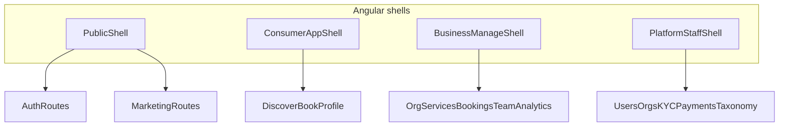

# Vaxiil Angular Web Frontend — Implementation Progress

Last updated: 2026-07-30 (PaymentMethod catalog, currency autocomplete, Management Admin)

## Summary

| Metric | Value |
|--------|-------|
| **Overall** | **100%** |
| Client role | Dedicated **full web** product (consumer + business management + platform staff) |
| Mobile client | **Flutter** remains primary for iOS/Android; responsive Flutter web stays maintained |
| Project root | [`web/`](../../web/) (Angular 21, **Yarn** package manager) |
| Shared API | `/api/v1/` + JWT — see [CONVENTIONS.md](../../CONVENTIONS.md) |

**Formula:** overall = sum of completed sub-weights across phases W0–W6 (weights total 100%).

Related docs:

- Design exports: [docs/design/](../design/) (canonical for web); fuller Stitch set in [mobile/designs/stitch_vaxiil_app_design/](../../mobile/designs/stitch_vaxiil_app_design/)
- Design system: [verdant_pulse_refined/DESIGN.md](../../mobile/designs/stitch_vaxiil_app_design/verdant_pulse_refined/DESIGN.md)
- Flutter responsive: [docs/mobile/responsive_report.md](../mobile/responsive_report.md)
- Platform progress: [IMPLEMENTATION.md](../../IMPLEMENTATION.md)
- Payments: [docs/backend/payment_integration/](../backend/payment_integration/) — Vaxiil setup: [vaxiil_setup.md](../backend/payment_integration/vaxiil_setup.md)

---

## 1. Overview

Vaxiil is a SaaS wellness platform (massage, therapy, room rentals) with privacy-focused features, multi-tenancy, bookings, and payments.

| Surface | Technology | Intent |
|---------|------------|--------|
| Mobile (and interim responsive web) | Flutter | Touch-first consumer + business hub; keep full responsive coverage |
| Dedicated web | **Angular** (latest) | Desktop-first full product: discovery/booking, dense **management** layouts, staff admin |
| API | Django REST Framework | Single contract for all clients |

### Design system (Verdant Pulse)

- **Typography:** Plus Jakarta Sans
- **Palette:** forest greens (`primary` ~`#0d631b` / `#00450d`), misty surfaces (`#f1fcf1` / `#f6faf7`), sunset orange accent sparingly
- **Layout rules:** no hard 1px section borders; tonal surface nesting; soft ambient shadows; glassmorphism for floating chrome
- **Icons:** Material Symbols Outlined (or project-equivalent icon set mapped to the same roles)

Primary design source for new web UI: **`docs/design/`**. Until more screens are exported there, adapt from `mobile/designs/stitch_vaxiil_app_design/` and copy exports into `docs/design/` as part of W0/W1.

---

## 2. Angular stack conventions

Use **current Angular** only. No NgModules for application features.

| Area | Mandate |
|------|---------|
| Components | **Standalone** only; prefer `inject()` over constructor DI |
| State | **Signals**: `signal`, `computed`, `linkedSignal`; `resource` / `httpResource` for async reads where appropriate |
| Templates | New control flow: `@if` / `@for` / `@switch` / `@defer`. Do **not** add `*ngIf` / `*ngFor` / `*ngSwitch` in new code |
| Forms | **Signal forms** (Angular signal forms API) for feature forms; reactive `FormBuilder` only where signal forms cannot cover a case yet |
| Change detection | Prefer **zoneless** bootstrap for the new app |
| Routing | Standalone routes; lazy `loadComponent` / `loadChildren`; functional guards (`CanActivateFn`, etc.) |
| HTTP | Functional `HttpInterceptorFn`; typed DTOs aligned with Flutter models / DRF serializers |
| Styling | CSS variables from design tokens + SCSS or CSS layers; breakpoints **768** (`md`) / **1024** (`lg`) aligned with Flutter, but **desktop-first shells** for management |
| Package manager | **Yarn** only (`yarn install`, `yarn start`, `yarn test`, `yarn lint`) — do not use npm for this project |
| Testing | Unit tests for services/stores and critical components; run `yarn test:ci` in `web/` before marking a step done |

### Target folder layout (when scaffolded)

```
web/
  src/
    app/
      core/           # auth, http interceptors, config, guards
      shared/         # design-system components, pipes, choice-enum UI
      shells/         # PublicShell, ConsumerAppShell, BusinessManageShell, PlatformStaffShell
      features/
        auth/
        discover/
        bookings/
        profile/
        business/     # org management
        staff/        # platform admin
      models/         # shared DTO types (mirror mobile contracts)
    styles/
      tokens.css      # Verdant Pulse CSS variables
```

---

## 3. Layout architecture

Management UX is a first-class goal: dense tables, filters, org switcher, and detail drawers — not phone chrome stretched to desktop.



| Shell | Responsibility | Chrome |
|-------|----------------|--------|
| **PublicShell** | Onboarding, login, register, legal | Marketing / split auth layouts from Stitch |
| **ConsumerAppShell** | Discover, bookings, messages, profile | Top nav + content rail (desktop); optional compact bottom nav only below `md` |
| **BusinessManageShell** | Org switcher, hub, services, bookings inbox, team, analytics, settlement, settings/KYB; toolbar **Back to app** pill + **Staff** pill when `is_staff` | **Left sidebar** + toolbar filters + table/detail split |
| **PlatformStaffShell** | KYC/KYB queues, taxonomy, cross-org bookings & payments | Staff sidebar + queue tables (replaces interim Django Admin over time) |

Business and staff features **must** use `BusinessManageShell` / `PlatformStaffShell`, not consumer phone layouts.

---

## 4. Screen inventory and design mapping

Status: `todo` | `partial` | `done` | `blocked` (backend missing).

### Auth & public

| Route (planned) | Design source | Backend API | Flutter parity | Status |
|-----------------|---------------|-------------|----------------|--------|
| `/onboarding` | [docs/design/stitch/splash_onboarding.html](../design/stitch/splash_onboarding.html); `splash_onboarding_refined` | — | `splash_page` | done |
| `/login` | `docs/design/stitch/login` | `POST /auth/login/`, verify-otp + Turnstile (`cf_turnstile_response`) | `login_page` | done |
| `/register` | `docs/design/stitch/signup` | `POST /auth/register/` + Turnstile | `register_page` | done |
| `/forgot-password` | password reset | `auth/password/reset/*` + Turnstile | forgot password | done |
| `/terms`, `/privacy` | versioned legal from API | `GET /legal/{terms\|privacy}/` | legal pages | done |
| `/legal-acceptance` | re-accept gate | `POST /auth/accept-legal/` | blocking acceptance | done |
| `/email-verification` | first-time email OTP gate | `POST /auth/email/verify/send/`, `POST /auth/email/verify/` | blocking verify | done |
| `/staff/fees` | fee ledger + config | `GET /staff/fees/`, summary, platform-settings | staff fees | done |

### Consumer

| Route (planned) | Design source | Backend API | Flutter parity | Status |
|-----------------|---------------|-------------|----------------|--------|
| `/discover` (home) | [docs/design/stitch/home_discovery.html](../design/stitch/home_discovery.html); `home_discovery_with_logo` | `organizations/discovery/`, `services/` | `home_page` | done |
| `/services` | catalog list (orphan / adapt home) | `GET /services/` | `services_page` | done |
| `/services/:id` | `service_details_*` | `GET /services/{id}/` | `service_detail_page` | done |
| `/services/:id/book` | `booking_scheduling_refined` | `POST /bookings/` | `service_booking_page` | done |
| `/bookings` | `my_bookings_*` (segmented tabs + Stitch cards) | `GET /bookings/` | `bookings_page` | done |
| `/bookings/:id` | `booking_details_upcoming` / `booking_details_past` (Stitch fidelity) | `GET/cancel/reschedule` + accept/decline (accept after `is_paid`); unpaid business reschedule → pay first; date/time inputs | `booking_detail_page` | done |
| `/bookings/:id/confirmation` | confirmation (orphan) | booking detail | `booking_confirmation_page` | done |
| `/bookings/:id/pay` | pay confirm (secure payment; store credit apply; verification fee disclosure) | `POST payments/.../payment-link/` (+ optional store credit; inscription in amount) | pay confirm before redirect | done (modal on wide; store credit split; inscription line) |
| `/payment-return` | payment return | `payments/transactions/{ref}/`, redirect docs | `payment_return_page` | done |
| `/profile` | profile + store credit (always) + KYC states | `GET/PUT /auth/profile/`, `GET payments/wallet/`, top-up | `profile_page` | done |
| `/profile/personal` | personal info (modal on wide) | `PUT /auth/profile/` | edit profile | done |
| `/profile/security` | password + email 2FA toggle | `auth/otp/send/`, `auth/password/change/`, `PUT profile` `two_factor_enabled` | security + profile 2FA sheet | done |
| `/profile/verify` | KYC via Sumsub WebSDK (start / pending / rejected / verified) | `POST /auth/kyc/sumsub/websdk-link/` | `identity_verification_page` | done |
| `/profile/verify/return` | Sumsub redirect return; POST return JWT sync then profile | `POST /auth/kyc/sumsub/return/` + profile | `kyc-verify-page` | done |
| `/notifications` | personal notification feed (`scope=personal`) | `GET /notifications/?scope=personal`, mark-read, unread-count | `notifications_page` | done (header bell) |
| `/messages` | personal messages | **shipped** — scoped personal inbox | inbox + invite + thread | done |
| `/business/:orgId/messages` | org booking/support inbox | `?organization_id=` | business messages | done |
| `/business/:orgId/notifications` | org notification feed | `?organization_id=` | scoped notifications | done |
| `/staff/messages` | platform support inbox | `?scope=staff` | staff messages | done |
| `/staff/notifications` | staff notification feed | `?scope=staff` | scoped notifications | done |

### Business management (`BusinessManageShell`)

| Route (planned) | Design source | Backend API | Flutter parity | Status |
|-----------------|---------------|-------------|----------------|--------|
| `/business` | `my_companies` | `organizations/`, `mine-summary/` | `business_list_page` | done |
| `/business/setup` | setup form | `POST /organizations/` | `business_setup_page` | done (modal on wide) |
| `/business/:orgId` | `company_hub_*`, `business_hub_kyb_*` | `GET/PATCH organizations/{id}/` | `business_profile_page` | done |
| `/business/:orgId/settings` | `company_settings` | `PATCH` org + `primary_city_id` / nested `/addresses/` CRUD | `business_settings_page` | done |
| `/business/:orgId/kyb` | KYB sections in hub | `submit-verification/` | KYB on profile | done (in hub) |
| `/business/:orgId/services` | services list (orphan / adapt catalog cards) | `organizations/{id}/services/` | `business_services_page` | done |
| `/business/:orgId/services/:id` | service edit | service CRUD + `city_id` + variants/features | `business_service_edit_page` | done (modal on wide) |
| `/business/:orgId/bookings` | bookings inbox (`my_bookings_*` card parity) | `GET /bookings/?organization=` | `business_bookings_page` | done |
| `/business/:orgId/bookings/:id` | booking detail | confirm (requires `is_paid`)/reject/complete/cancel (F|P only)/reschedule accept-decline; venue icons | `business_booking_detail_page` | done (modal on wide) |
| `/business/:orgId/team` | team roster | `GET/POST .../team/` invite + role patch/delete | `business_team_page` | done |
| `/business/:orgId/analytics` | `company_analytics` | `GET .../analytics/` live aggregates | `business_analytics_page` | done |
| `/business/:orgId/settlement` | settlement accounts via PaymentMethod picker + amount-only requests | `organizations/{id}/settlement/*`, `payments/methods/` | `business_settlement_page` | done |
| `/business/:orgId/messages` | org booking/support inbox | `?organization_id=` | business messages | done |
| `/business/:orgId/notifications` | org notification feed | `?organization_id=` | scoped notifications | done |

### Platform staff (`PlatformStaffShell`)

| Route (planned) | Design source | Backend API | Flutter parity | Status |
|-----------------|---------------|-------------|----------------|--------|
| `/staff` | staff home (new desktop) | `GET /api/v1/staff/overview/` + `is_staff` gate | N/A (Django Admin replacement) | done |
| `/staff/users` | staff queue (new desktop) | `GET/POST /api/v1/staff/users/` approve/reject (status-gated) | N/A | done |
| `/staff/organizations` | KYB queue (new desktop) | approve/reject/suspend/unsuspend (status-gated) | N/A | done |
| `/staff/taxonomy` | categories/subcategories/features tabs | `staff/taxonomy/categories|subcategories|features` | N/A | done |
| `/staff/bookings` | cross-org bookings | `GET /bookings/` (staff) | N/A | done |
| `/staff/payments` | ledger | `GET /api/v1/staff/payments/` (+ search/status filters) | N/A | done |
| `/staff/fees` | fee ledger + config tabs (USD inscription/annual/settlement min + FX rates) | `staff/fees/`, platform-settings, category fees, `staff/fx-rates/` | N/A | done |
| `/staff/settlements` | settlement request queue (complete + image / reject) | `staff/settlements/` | N/A | done |
| `/staff/messages` | platform support inbox | `?scope=staff` | N/A (no staff Flutter shell) | done |
| `/staff/notifications` | staff notification feed | `?scope=staff` | N/A | done |

### Geo / default country

| Capability | Backend | Flutter | Angular | Status |
|------------|---------|---------|---------|--------|
| `organizations.Country` ↔ `cities.Country` OneToOne | done | — | — | done |
| `GET /organizations/cities/?country=&q=` | done | `listCities` | `listCities` | done |
| Operating addresses `cities_city` FK + nested CRUD | done | setup/settings | setup/settings | done |
| User `default_country` on profile | done | edit profile | personal info | done |
| Catalog `?country=` + discover override | done | services/home | discover/services | done |

Ops: after migrate, import GeoNames via django-cities management commands (`cities --import` / project `CITIES_FILES` in settings). Tests seed minimal continent/country/city rows without a full import.

| Gap | Impact | Rule |
|-----|--------|------|
| Messaging / chat API | `/messages` | Shipped (`/api/v1/messaging/`); flag `messagesEnabled` on. Booking lifecycle inbox remains `/notifications`. |
| Favorites / ratings API | consumer extras | Defer until backend phase |

Shipped (no longer gaps): team invite/role write, live analytics aggregates, `AvailabilityService` on create/reschedule, booking confirm/reject/complete, privacy-aware booking `client` + demographics (`date_of_birth`/`sex`/`show_email`), org `require_client_name` on service detail, share-consent confirm dialog, required decline reasons, refund wallet on cancel + apply at pay.

---

## 5. Phased implementation (100% complete)

Weights sum to **100%**. Checkboxes use `(completed% / weight%)`.

### Phase W0: Scaffold & tooling (10% / 10%) ✅

- [x] Initialize Angular app under `web/` with standalone defaults (3% / 3%) — Angular 21, zoneless, Yarn
- [x] Lint/format (ESLint + Prettier or project standard), path aliases (2% / 2%) — `@/*` → `src/app/*`
- [x] Environment config (`apiBaseUrl`, feature flags) (2% / 2%) — `http://localhost:9091/api/v1/`
- [x] CI stub (install + lint + test) (1% / 1%) — [`.github/workflows/web.yml`](../../.github/workflows/web.yml)
- [x] Seed `styles/tokens.css` from Verdant Pulse + Stitch HTML tokens (1% / 1%)
- [x] Expand `docs/design/` with remaining Stitch screen exports from mobile designs (1% / 1%) — see [docs/design/stitch/README.md](../design/stitch/README.md)

### Phase W1: Design system & shells (15% / 15%) ✅

- [x] Tokenized theme (colors, type scale, radii, shadows) (3% / 3%)
- [x] Shared UI: buttons, inputs, badges, choice-enum chips (`css` → semantic styles) (3% / 3%)
- [x] Shared UI: data table, filters toolbar, empty/error states (3% / 3%)
- [x] `PublicShell` + auth layout (2% / 2%) — logo at `public/assets/logo.png`, stub login/register/onboarding
- [x] `ConsumerAppShell` (top nav, responsive rail) (2% / 2%) — stub discover/bookings/profile
- [x] `BusinessManageShell` (sidebar, org switcher slot, content outlet) (1.5% / 1.5%)
- [x] `PlatformStaffShell` (staff nav) (0.5% / 0.5%)

### Phase W2: Auth & API core (15% / 15%) ✅

- [x] Typed HTTP client layer + error mapping (3% / 3%) — `mapHttpError`, `environment.apiBaseUrl`
- [x] JWT login/register/logout + secure token storage (3% / 3%) — `localStorage` via `TokenStorageService`
- [x] Refresh interceptor + auth guards (functional) (3% / 3%) — GET retry after refresh; `authGuard` / `guestGuard`
- [x] Shared `ChoiceEnum` model + display component (parity with Flutter) (2% / 2%) — `parseChoiceEnum` + chip
- [x] Pagination helpers (`count` / `next` / `results`, `page` / `page_size`) (2% / 2%)
- [x] Profile read/update + avatar upload client (2% / 2%) — `/profile` page; KYC UI deferred to W3
- [x] Cloudflare Turnstile on guest auth (login, OTP, register, password reset) — `app-turnstile` + `cf_turnstile_response`
- [x] Optional client GPS on payment/booking mutating POSTs (`client_latitude` / `client_longitude`) via `withOptionalClientLocation`

### Phase W3: Consumer web (20% / 20%) ✅

- [x] Home discovery (categories, featured, nearby) (4% / 4%) — featured + recent sections, icon category chips
- [x] Services list + detail (3% / 3%) — Stitch fidelity + modal on wide
- [x] Booking create / schedule UI (4% / 4%) — Stitch calendar/time chips + modal on wide
- [x] My bookings list + detail (cancel/reschedule) (4% / 4%) — detail modal on wide; confirmation route
- [x] Payment link start + `/payment-return` polling (3% / 3%)
- [x] Profile, edit profile, KYC submit (2% / 2%)
- Guest browse: public `AllowAny` on discovery + catalog; auth-aware shell + logout

### Phase W4: Business management (25% / 25%) ✅

- [x] Org list, create/setup, switcher (4% / 4%)
- [x] Org hub + KYB submit (4% / 4%)
- [x] Settings + address/geo + require_client_name (3% / 3%)
- [x] Provider services list + create/edit + variants/features (5% / 5%)
- [x] Org-scoped bookings inbox + confirm/reject/complete/reschedule (5% / 5%)
- [x] Team roster + invite/role write (2% / 2%)
- [x] Analytics dashboard (live aggregates) (2% / 2%)

### Phase W5: Platform staff admin (10% / 10%) ✅

- [x] Staff auth gate (`is_staff`) (1% / 1%) — profile field + `staffGuard`
- [x] Users / KYC review queue (3% / 3%) — `/api/v1/staff/users/` + Angular queue
- [x] Organizations / KYB review queue (3% / 3%) — `/api/v1/staff/organizations/`
- [x] Taxonomy management UI (1.5% / 1.5%) — staff category CRUD
- [x] Cross-org bookings + payments ledger views (1.5% / 1.5%)

### Phase W6: Hardening (5% / 5%) ✅

- [x] Accessibility pass on shells and critical forms (1.5% / 1.5%) — skip links, modal dialog labels, form labels
- [x] E2E smoke (auth → discover → book → business inbox) (1.5% / 1.5%) — Playwright `yarn e2e` (API mocked)
- [x] Perf budgets (lazy routes, image sizing) (1% / 1%) — lazy routes; hero `width`/`height` + aspect-ratio
- [x] Sync this doc + [IMPLEMENTATION.md](../../IMPLEMENTATION.md) percentages after each release slice (1% / 1%)

---

## 6. AI / agent sync rules (web ↔ mobile ↔ backend)

Agents and humans **must** follow these rules when changing APIs or client features. Short always-on form: [.cursor/rules/web-client-sync.mdc](../../.cursor/rules/web-client-sync.mdc).

### 6.1 Single contract

- All clients consume **`/api/v1/`** with the same JWT auth model.
- Do **not** invent parallel admin-only JSON shapes unless they are versioned and documented.
- Prefer ViewSets and existing serializer patterns (see [CONVENTIONS.md](../../CONVENTIONS.md)).

### 6.2 Triple sync checklist

On **any** API or DTO change, complete all that apply before considering the work done:

1. **Backend** — serializer/view + `uv run pytest`
2. **Flutter** — models/repos/widgets + `flutter test` in `mobile/`
3. **Angular** — models/services/components + web test script in `web/` (once scaffolded)
4. **Docs** — update percentages/checkboxes in this file and [IMPLEMENTATION.md](../../IMPLEMENTATION.md) when behavior ships

### 6.3 Choice enums

- Serialized as `{ "value", "title", "css" }` where `css` is a semantic token (`default`, `primary`, `secondary`, `success`, `warning`, `danger`, `info`).
- Flutter: `ChoiceEnumData` / `ChoiceEnumWidget`.
- Angular: shared `ChoiceEnum` type + chip/badge that maps the same tokens; unknown `css` → safe fallback.
- `title` is localized by the backend (`Accept-Language` en/fr). Do not invent client-side title maps.

### 6.3b Internationalization (en / fr)

- Always translate user-facing UI chrome (Angular JSON catalogs + Flutter ARB) and backend choice/error strings (gettext). See [CONVENTIONS.md](../../CONVENTIONS.md) and [.cursor/rules/i18n.mdc](../../.cursor/rules/i18n.mdc).
- Clients send `Accept-Language`; Angular `LocaleService` + `t` pipe; Flutter `AppLocalizations` + language settings.

### 6.4 Feature parity matrix

New user-facing capability requires an explicit row:

| Capability | Backend | Flutter | Angular | Notes |
|------------|---------|---------|---------|-------|
| Example | done / todo | done / todo / N/A | done / todo / N/A | reason if N/A |
| Platform staff KYC/KYB review | done | N/A | done | Staff is web/admin; Flutter/Angular submit via Sumsub |
| Sumsub user KYC (token / WebSDK / webhook / return sync) | done | done | done | Access token (Flutter SDK), websdk-link (Angular + Flutter web), redirect return JWT sync, webhook |
| Secure payment confirm (no provider brand) | done | done | done | MM Aggregator collect server-side; UI says secure payment |
| Store credit (refund wallet) + top-up | done | done | done | Store credit; top-up via in-app collection panel |
| KYC required to book | done | done | done | Backend create gate + client Book CTA |
| Email login OTP / password reset | done | done (login OTP; reset API) | done | HTML Verdant Pulse mail; Flutter reset UI still light |
| Email verification + welcome | done | done | done | Blocking gate before legal; welcome quick-action mail |
| Profile 2FA enable/disable | done | done (profile sheet) | done | `PUT two_factor_enabled` |
| Unpaid business reschedule → pay before accept | done | done | done | Accept gated on `is_paid` |
| Named booking time conflicts | done | surfaces API error | surfaces API error | Overlap names conflicting ref/time |
| Org staff sees age/sex when name private | done | done | done | Name/phone/email still gated by share flags |

Use `N/A` only with a written reason (e.g. biometric unlock is mobile-only).

### 6.5 Breaking changes

- Prefer additive, compatible fields.
- Breaking JSON shape changes require API version bump **or** coordinated mobile + web releases.
- Do not ship a backend break that only one client understands.

### 6.6 Design sync

- Start new UI from **`docs/design/`** (or copy Stitch HTML/PNG there first). Open the matching `code.html` + `screen.png` before implementing.
- Do not restyle Angular away from Verdant Pulse tokens without updating design sources.
- Business/staff screens use management shells; do not clone consumer bottom-nav chrome for desktop ops.
- Cursor rule: [.cursor/rules/web-design.mdc](../../.cursor/rules/web-design.mdc).

#### Page vs modal (Flutter `modalOnWide` parity)

Wide (≥768): centered dismissible panel (max-width ~720) over dimmed barrier. Compact: full page. Source: Flutter `vaxiilAdaptivePage` / `app_router.dart`.

| Presentation | Routes |
|--------------|--------|
| **Modal on wide** | `/services/:id`, `/services/:id/book`, `/bookings/:id`, booking confirmation, `/bookings/:id/pay`, payment return, `/profile/personal`, `/profile/security`, `/notifications`, privacy, KYC; `/business/setup`, `/business/:orgId/services/new\|:id`, `/business/:orgId/bookings/:id` |
| **Always pages** | `/discover`, `/services`, `/bookings`, `/profile`, messages; `/business`, hub, settings, services list, bookings inbox, team, analytics; auth routes |

Confirm/delete prompts stay small dialogs on all breakpoints.

### 6.7 Management layouts

- Org operator features → `BusinessManageShell`.
- Platform staff features → `PlatformStaffShell`.
- Prefer tables + filters + detail drawers over card grids for operational lists.

### 6.8 Tests before “done”

| Area | Command |
|------|---------|
| Backend | `uv run pytest` (from backend project root as documented) |
| Mobile | `flutter test` in `mobile/` |
| Web | `yarn test:ci` / `yarn lint` / `yarn e2e` in `web/` (Playwright; see `web/e2e/README.md`) |

### 6.9 No silent stubs

- If the backend is missing, mark the screen **blocked**, show an honest empty-state or feature flag, and **do not** invent response shapes that Flutter/Angular will later disagree on.
- Provisional analytics UI may render placeholder API payloads only when the real endpoint already returns documented placeholders.

### 6.10 Flutter responsive remains

- Angular does **not** replace Flutter mobile.
- Keep [docs/mobile/responsive_report.md](../mobile/responsive_report.md) accurate when changing Flutter layout.
- Prefer Angular for new **desktop management** density; prefer Flutter for native mobile UX.

---

## 7. Progress log

| Date | Overall | Notes |
|------|---------|-------|
| 2026-07-26 | 100% | Sumsub redirect return: JWT verify + applicant/docs sync API; Angular/Flutter return wiring |
| 2026-07-26 | 100% | Sumsub KYC: access-token + WebSDK link + webhook; Angular redirect/return; Flutter Idensic SDK; ChoiceEnum writable fields fix |
| 2026-07-26 | 100% | Scoped personal/business/staff message & notification feeds; django-cities addresses (`city_id`); user `default_country` + discover country filter |
| 2026-07-26 | 100% | Service image upload + feature cards; staff user detail (KYC preview, CS chat, wallet credit); platform support chat; richer notifications + header bell |
| 2026-07-25 | 100% | In-app messaging M0–M6 (API + Angular Stitch screens + Flutter min); `messagesEnabled` on |
| 2026-07-25 | 100% | Email verification gate + welcome mail; payment/wallet/team invite emails |
| 2026-07-20 | 100% | Unpaid reschedule pay (`payment-link` allows `R`); notifications inbox (web+Flutter); open-slots API + create/reschedule calendars |
| 2026-07-20 | 100% | HTML email shell (OTP/notifications + newsletter stub); 2FA toggle; unpaid reschedule pay-first; conflict naming; consumer date/time reschedule |
| 2026-07-20 | 100% | `is_paid` + pending reschedule accept/decline; filter venues by `effective_location_types`; service/org accepted venues; derive prices from variants |
| 2026-07-19 | 100% | Booking/payment polish: modal dismissUrl, store-credit UX + top-up, KYC book gate, email OTP/password, richer bookings list, business venue/privacy |
| 2026-07-18 | 100% | Booking share-consent dialog + CTA errors; required decline reasons; refund wallet (profile + pay apply) |
| 2026-07-18 | 100% | Privacy/demographics, Trust Alias regenerate, business confirm/options/team/analytics/availability; messaging plan doc |
| 2026-07-18 | 100% | Stitch fidelity: booking detail upcoming/past + profile KYC states (en/fr); pay-confirm unchanged |
| 2026-07-18 | 100% | W5 staff APIs/UI + W6 a11y/Playwright/perf; booking service summary; MainMoney-only pay-confirm route |
| 2026-07-18 | 85% | W3 complete: discover featured/recent + category icons, booking schedule Stitch UI, confirmation, payment-return, KYC |
| 2026-07-18 | 80% | W3 fixes (Stitch fidelity, guest AllowAny catalog, shell logout, modalOnWide) + full W4 business management |
| 2026-07-18 | 55% | W3 consumer slice: discover, services list/detail/book, my bookings + cancel/reschedule; en/fr i18n foundation (backend gettext, Flutter ARB, Angular catalogs) |
| 2026-07-18 | 40% | Phase W2 complete: Stitch images in `web/public/assets/images/`, JWT auth/HTTP core, login/register/profile wired |
| 2026-07-18 | 25% | Phase W1 complete: logo asset, design tokens, shared UI, four shells + stub routes |
| 2026-07-18 | 10% | Phase W0 complete: Angular 21 scaffold under `web/` with Yarn, tokens, CI, design inventory |
| 2026-07-18 | 0% | Document created; Angular `web/` not scaffolded yet |
|
